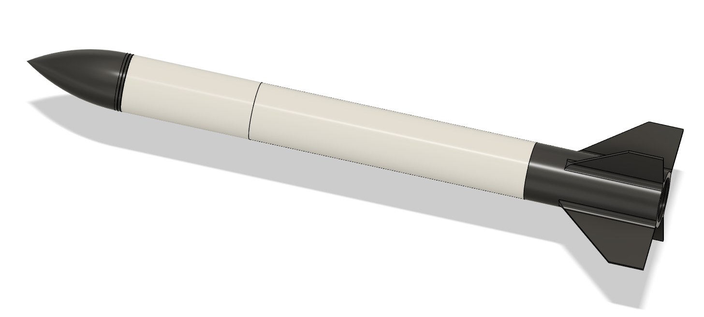
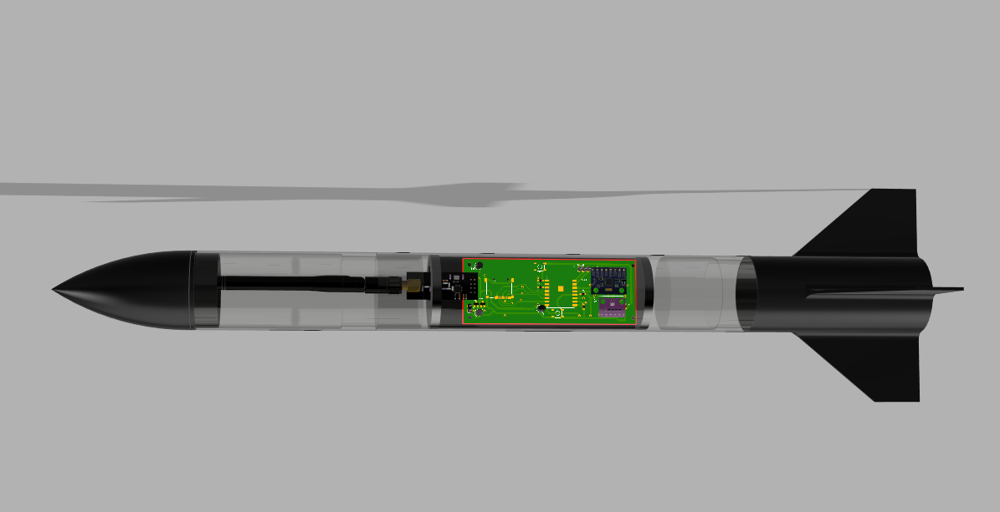

# Mini Foguete

Projeto de desenvolvimento de um Minifoguete com Base em Sistemas de Massa Variável para Materia de Fisica Experimental A.
 
O projeto consiste em uma abordagem sistemática para o desenvolvimento e aprimoramento de foguetes em miniatura, utilizando uma metodologia que envolve aquisição de dados, cálculo de velocidade do foguete e comparação com dados reais obtidos durante os testes com intenção de demonstrar o funcionamento do momento linear em um sistema de massas variáveis. O projeto consiste na obtenção de propelente para realizar teste e através dos dados obtidos calcular velocidade que o foguete pode atingir que após esses será realizado o lançamento de mini foguete e obtenção dos dados de voo para comparação com resultado obtido com cálculo.  

Etapas :
1. Aquisição do Motor. 
2. Teste Estático do Motor
3. Desenvolvimento de uma Avionica para aferição da Altitude.
4. Desenvolvimento do Minifoguete: Utilizando um modelo 3D como base com ajuste para acomodar uma aviônica.
5. Com Massa do Minifoguete Calcular a Velocidade.
6. Lançar o Foguete.
7. Comparar os Dados.

## 1. Motor.

Por já ter conhecimento na produção do motor não foi preciso comprar, em que foi produzido KNSu e a carcaça do motor feita com cano de PVC de 3/4.

## 2. Teste Estatico 

Para realização do Teste estatico foi utilizada uma celula de carga de 10Kg com Hz711 modificado para 80hz para melhor precisão das leituras obtendo os resultados Abaixo:

## 3.Avionica 

Nesta etapa do projeto, foi desenvolvida uma PCB utilizando o software Eagle. A PCB tem como objetivo realizar a aferição da altitude durante o voo e envio dos dados para uma base remota. A placa utiliza componentes específicos para cada função, como o microcontrolador ESP8266 para cálculos, o sensor BMP280 para medição de altitude e temperatura, o sensor MPU6050 para medição de aceleração, o módulo NRF24L01+ para transmissão dos dados, um slot de Micro SD para funcionar como datalogger do voo, reguladores de tensão para ajustar a voltagem de 3,7V para 3,3V, um circuito para aferição da tensão da bateria, um circuito para acionar o paraquedas e um buzzer. Além disso, são utilizadas duas baterias de 3,7V para alimentação da placa.

## 4.Desenvolviemto do Minifoguete 

Nesta etapa do projeto, foi utilizado o modelo de foguete 3D Modular Model Rocket disponível no Thingiverse, que pode ser encontrado no seguinte link: [3D Modular Model Rocket](https://www.thingiverse.com/thing:8754).

Esse modelo de foguete foi modificado para permitir o acoplamento de diferentes tamanhos de motores. Além disso, o programa OpenRocket foi utilizado para ajustar a estabilidade do MiniFoguete.

## 5.Calculos
